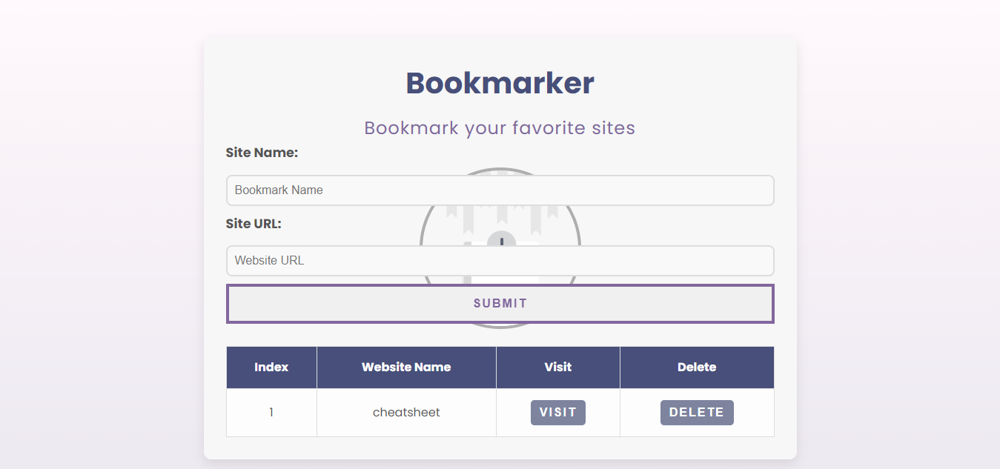

# BookMark




## Overview
**BookMark** is a web application that allows users to manage their bookmarks efficiently. The application implements full CRUD operations, enabling users to create, read, and delete their bookmarks. This project showcases my skills in web development and understanding of client-server interactions.

## Features
- 📚 **Create Bookmarks:** Users can add new bookmarks with titles and URLs.
- 🔍 **Read Bookmarks:** View a list of all saved bookmarks.
- 🗑️ **Delete Bookmarks:** Remove bookmarks that are no longer needed.
- 💾 **Data Storage:** Utilizes Local Storage to persist data across sessions, ensuring that bookmarks are saved even after the browser is closed.
- 🎨 **User-Friendly Interface:** Clean and intuitive design for easy navigation and usage.
- 📱 **Responsive Design:** The application adapts to different screen sizes and devices, ensuring a user-friendly experience on desktops, tablets, and mobile phones.
## Demo
You can view the live demo of the application [here](https://nourkuktut.github.io/BookMark/).

## Installation

To run the project locally, follow these steps:

### Prerequisites
- Any modern web browser.

### Steps

1. Clone the repository:
   ```bash
   git clone https://github.com/nourkuktut/BookMark.git
2. Navigate to the project directory:
   ```bash
         cd BookMark
3. Open the index.html file in your browser or run a live server for development:
     ```bash
           open index.html

 ## Usage:
 - Users can create new bookmarks by filling out the provided form.
 - The bookmarks will be displayed in a list format, allowing users to click on them to visit the URLs.
 - Users can  visite or delete bookmarks using the respective buttons next to each bookmark entry.

 ## Technologies
- HTML5: For the structure of the web pages.
- CSS3: For styling and layout.
-  JavaScript: For dynamic functionalities and CRUD operations.
- Local Storage: To persist data across sessions, allowing users to save their bookmarks even after closing the browser.

## Contributing
If you would like to contribute to this project, feel free to fork the repository and submit a pull request. Here’s how you can contribute:
1. Fork this repository.
2. Create a new branch (git checkout -b feature/your-feature-name).
3. Make your changes and commit them (git commit -m 'Add your-feature-name').
4. Push to the branch (git push origin feature/your-feature-name).
5. Open a Pull Request.

### License:
- This project is licensed under the MIT License.
## Contact:
For inquiries about this project or similar development services, feel free to contact me:
<br>
**Email: [here](nourkutkut12@gmail.com).**

